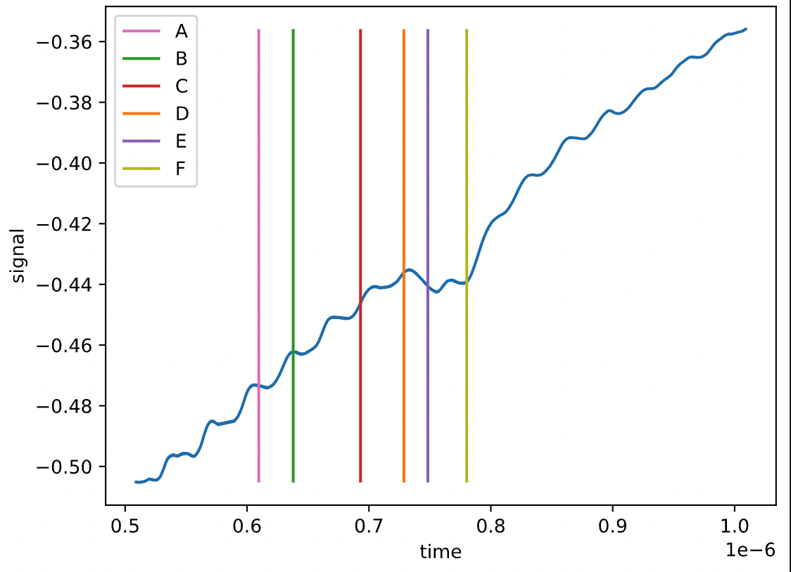

# Scan Data Object
My personal library for working with data from the E11 lab. The data format used in the lab is HDF5. All the data from an experiment is included in this file, including metadata. The files can be read for analysis using the [h5py](https://www.h5py.org) library. A description of the Scan object is below as well as a reference section can be found below that outlines the structure of these files.

How to use Scan object:
```
from e11scan import scan
filename = 'tests/20210707_005_scan.h5'
function = '-(a0 - a1)/((a0 - a1) + (a0 - a2))'
sc = scan(filename = filename, function = function)
```
The scan object automatically processes the data by grouping and averaging measurements made at the same point and subtracting a baseline value. The baseline that is subtracted depends on the type of the experiment. The experiment type is read from the metadata in the h5py file.

Experiment Types
- Microwave Scan (microwave):
    - Baseline processing: baseline calculated from the signal of the lowest 10 microwave frequencies.
- Time Scan (time): 
    - Baseline calculated from the signal measured for the lowest time value.
- Generic Scan (generic): 
    - Baseline calculated from the signal measured for the lowest x value.

The experiment type used can also be set manually:
```
scan(filename = filename, function = function, experiment = 'experiment')
```

Change the evaluation function:
```
function = 'a0 - a1'
sc.update_function(function)
```

Access an individual trace:
```
times, signal = sc.trace(index)
```

Access locations of windows:
```
>>> sc.windows
{'A': 1.0063636363636365e-07,
 'B': 1.288636363636364e-07,
 'C': 1.840909090909091e-07,
 'D': 2.196818181818182e-07,
 'E': 2.3931818181818186e-07,
 'F': 2.7122727272727274e-07}
```
The location of the windows are in reference to the first time on the scope i.e. ``self.f['osc_0'].attrs['t0']``.

Plot a trace with location of windows:
```
>>> sc.plot_trace(index)
```


##  Reference: File structure
A file can be loaded using 
```
f = h5py.File('FILENAME', 'r')
```
The file is also accessible from the Scan object:
```
>>> sc = scan(filename = 'FILENAME', function = 'a0')
>>> sc.f
<HDF5 file "20210707_005_scan.h5" (mode r)>

```
The metadata associated with the file is stored as a proxy object accessible using key value pairs through `f.attrs`. The metadata available depends on which oscilloscope was used.


Example:
```
>>> sc.f.attrs.keys()
<KeysViewHDF5 ['run_ID', 'timestamp', 'v0_loops', 'v0_num', 'v0_options', 'v0_repeats', 'v1_loops', 'v1_num', 'v1_options', 'v1_repeats', 'var 0', 'var 1']>
```
| `key`     |Description|
|--------------|--------------------------------------------------------|
| `run_ID`     | Date of file and measurement number i.e. `20210707_005` |
| `timestamp`  | i.e. `2021-07-07 15:04:14`                              |
| `v0_loops`   | Number of measurement loops on `v0`                    |
| `v0_num`     | Number of measurements on `v0`                        |
| `v0_options` |                                                        |
| `v0_repeats` |                                                        |
| `v1_loops`   |                                                        |
| `v1_num`     |                                                        |
| `v1_options` |                                                        |
| `v1_repeats` |                                                        |                                                |
| `var 0`      | Type of measurement i.e. `microwaves (GHz)`             |
| `var 1`      |                                                        |

Alternative Example (lecroy)
| `key`                | Description                                               |
|----------------------|-----------------------------------------------------------|
| `num_rows`           |                                                           |
| `run_id`             | Date of file and measurement number i.e.   `20210707_005` |
| `scope_VISA`         | Visa name i.e `lecroy`                                    |
| `scope_averages`     | Number of averages used by scope                          |
| `scope_channels`     | Channel number                                            |
| `scope_max_points`   | Number of points                                          |
| `scope_noise filter` |                                                           |
| `scope_timeout (ms)` |                                                           |
| `timestamp`          | i.e `2021-07-07 15:04:14`                                 |
| `v0_VISA`            | Extra visa info i.e. `COM 4`                              |
| `v0_hardware`        |                                                           |
| `v0_loops`           | Number of measurement loops on `v0`                       |
| `v0_options`         |                                                           |
| `v0_repeats`         |                                                           |
| `v1_hardware`        |                                                           |
| `v1_loops`           |                                                           |
| `v1_options`         |                                                           |
| `v1_repeats`         |                                                           |

Each file has two datasets:
- `analysis`: Data after applying windows
- `osc_0`: Data before applying windows 

Each of these datasets also has an associated `attrs` object containing useful metadata as well the data itself.

### analysis
The metadata associated with analysis includes the location of the windows as well as the function used to perform analysis in the e11 control software.

```
>>> sc.f['analysis'].attrs.keys()
<KeysViewHDF5 ['A', 'B', 'C', 'D', 'E', 'F', 'a0 ', 'a1', 'a2', 'f']>
```

The data can be read into a pandas data frame using:

```
>>> import pandas as pd
>>> df = pd.DataFrame.from_records(sc.f['analysis'], columns=sc.f['analysis'
].dtype.fields.keys())
>>>
```

The dataframe then has columns: `v0, v1, w0, w1, a0, a1, a2`.

### osc_0
This contains the time of arrival data stored on the oscilloscope. The metadata includes the `t0` and `dt` time step information.

```
>>> sc.f['osc_0'].attrs.keys()
<KeysViewHDF5 ['dt', 't0']>
```

The individual scans can be loaded into a dataframe using:
```
pd.DataFrame.from_records(sc.f['osc_0'])
```
Or accessed using:
```
sc.f['osc_0'][index]
```

## Instillation
```
pip install git+https://github.com/lukelbro/scan
```


